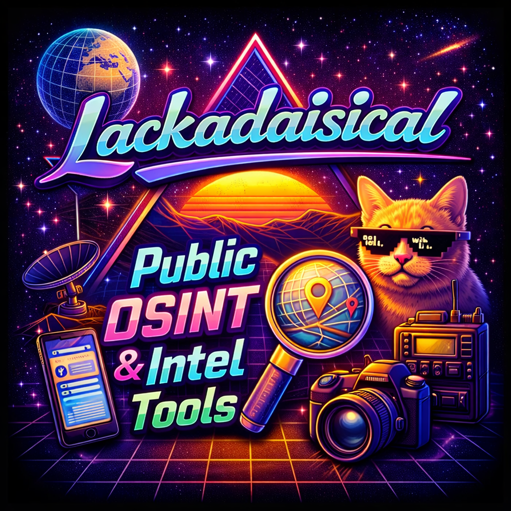

<p align="center">
  
</p>

<h1 align="center">Public OSINT & Intelligence Gathering Tools</h1>

<p align="center">
  <strong>Production-grade multi-language toolkit for Open Source Intelligence (OSINT) gathering and reconnaissance</strong>
</p>

<p align="center">
  <a href="#features">Features</a> •
  <a href="#installation">Installation</a> •
  <a href="#usage">Usage</a> •
  <a href="#documentation">Documentation</a> •
  <a href="#contributing">Contributing</a> •
  <a href="#license">License</a>
</p>

<p align="center">
  
  
  
</p>

---

## 🎯 Overview

**Zero mock code. Zero placeholders. Zero bullshit.** This toolkit provides fully functional OSINT capabilities with enterprise-grade privacy, anonymity, and operational security features.

**Built for professionals who need:**
- Comprehensive intelligence gathering
- Privacy-preserving reconnaissance
- Operational security (OPSEC)
- Multi-language implementations
- Production-ready code

## ✨ Features

### 🔍 Core Intelligence Gathering

#### Domain Intelligence (`tools/domain_intel.py`)
- WHOIS information with registrar details
- Complete DNS record enumeration (A, AAAA, MX, NS, TXT, SOA, CNAME, CAA)
- SSL certificate analysis
- Subdomain discovery
- Domain age and expiry monitoring

#### IP Intelligence (`tools/ip_intel.py`)
- Geolocation with multiple providers
- ASN (Autonomous System Number) details
- ISP and organization information
- Reverse DNS lookup
- Network range identification

#### Email Intelligence (`tools/email_intel.py`)
- RFC-compliant email validation
- MX record verification
- Disposable email detection
- Social media profile discovery
- Email pattern generation

#### Web Scraping (`tools/web_scraper.py`)
- Email and phone number extraction
- Social media link discovery
- Technology stack detection
- Meta information extraction
- JavaScript library detection

#### Social Media Intelligence (`tools/social_media_intel.py`)
- Cross-platform username search
- Profile availability checking
- Account analysis
- Related username generation

### 🛡️ Privacy & Anonymity (NEW!)

#### Tor Integration (`privacy/tor_proxy.py`)
```python
from privacy.tor_proxy import TorSession

session = TorSession()
response = session.get('https://target.com')
session.renew_circuit()  # New exit node
```

#### Proxy Rotation (`privacy/proxy_rotation.py`)
```python
from privacy.proxy_rotation import ProxyRotator, ProxySession

rotator = ProxyRotator()
rotator.add_proxy('socks5', 'proxy1.com', 1080)
session = ProxySession(rotator, strategy='random')
```

#### Request Obfuscation (`privacy/request_obfuscation.py`)
- Randomized browser fingerprints
- User-Agent rotation
- HTTP header obfuscation
- Rate limiting
- Anti-detection patterns

#### Secure Credential Storage (`privacy/secure_credentials.py`)
```python
from privacy.secure_credentials import SecureCredentialStore

store = SecureCredentialStore()
store.unlock("master_password")
store.set("SHODAN_API_KEY", "your_key")
store.save()  # Encrypted at rest
```

#### Data Sanitization (`privacy/data_sanitization.py`)
- PII detection (emails, phones, SSN, credit cards, IPs)
- Data redaction and masking
- Pseudonymization
- Data minimization

#### Secure Logging (`privacy/secure_logging.py`)
- Audit trail logging
- Encrypted sensitive data
- Automatic PII sanitization
- Session tracking

### 🔧 Standalone Tools

**Multi-language implementations with zero dependencies:**

| Tool | Language | Purpose |
|------|----------|---------|
| `domain_recon.py` | Python | Domain reconnaissance |
| `email_hunter.py` | Python | Email discovery |
| `portscanner.js` | Node.js | Asynchronous port scanning |
| `dns_lookup.ps1` | PowerShell | Windows DNS analysis |
| `whois_lookup.sh` | Bash | UNIX WHOIS tool |
| `ip_geolocator.rb` | Ruby | IP geolocation |
| `http_headers.php` | PHP | HTTP header analysis |
| `network_scanner.go` | Go | High-performance scanning |
| `ssl_checker.pl` | Perl | SSL/TLS checking |
| **`dns_leak_checker.py`** | Python | **DNS leak detection** |
| **`metadata_scrubber.py`** | Python | **Remove metadata from files** |
| **`secure_delete.py`** | Python | **Secure file deletion** |
| **`mac_randomizer.sh`** | Bash | **MAC address randomization** |

### 🚀 Advanced Features

#### Advanced Domain Intel (`advanced/advanced_domain_intel.py`)
- Historical data retrieval
- WAF/CDN detection
- Security header analysis
- Common port scanning
- Email address extraction

#### Advanced IP Intel (`advanced/advanced_ip_intel.py`)
- Reputation scoring
- Threat intelligence
- Network topology mapping
- BGP route analysis

### 🌐 Multi-Platform Tools (`tools-multiplatform/`)

**Professional implementations:**

- **Node.js**: Advanced reconnaissance, web scraping, threat intel
- **C/C++**: High-performance port scanner, DNS resolver, subdomain finder
- **.NET**: Enterprise OSINT framework with domain analyzer, WHOIS, email validator
- **Assembly**: Low-level network probe

## 📦 Installation

### Quick Start

```bash
# Clone repository
git clone https://github.com/Lackadaisical-Security/public-osint-and-intel-tools.git
cd public-osint-and-intel-tools

# Install Python dependencies
pip install -r requirements.txt

# (Recommended) Use virtual environment
python3 -m venv venv
source venv/bin/activate  # Windows: venv\Scripts\activate
pip install -r requirements.txt
```

### API Keys Setup

Create `.env` file for enhanced functionality:

```env
# Social Media APIs
TWITTER_API_KEY=your_twitter_api_key
TWITTER_API_SECRET=your_twitter_api_secret

# Security APIs
SHODAN_API_KEY=your_shodan_api_key
VIRUSTOTAL_API_KEY=your_virustotal_api_key
HIBP_API_KEY=your_hibp_api_key

# Geolocation
IPINFO_TOKEN=your_ipinfo_token
```

**Secure credential storage:**
```python
from privacy.secure_credentials import SecureCredentialStore

store = SecureCredentialStore()
store.unlock()
store.set("SHODAN_API_KEY", "your_key_here")
store.save()  # Encrypted with password
```

### Dependencies

**Python Tools:**
- Python 3.7+
- See `requirements.txt` for packages

**Standalone Scripts:**
- Python 3.6+, Node.js 12+, PowerShell 5.0+
- Bash 4+, Ruby 2.5+, PHP 7.0+, Go 1.16+, Perl 5.10+

**Multi-Platform:**
- Node.js 14+, GCC/MinGW, .NET 6.0 SDK, NASM

## 🎓 Usage

### Command Line Interface

```bash
# Domain intelligence
python osint_cli.py -d example.com

# IP analysis
python osint_cli.py -i 8.8.8.8

# Email investigation
python osint_cli.py -e user@example.com

# Web scraping
python osint_cli.py -w https://example.com

# Save results
python osint_cli.py -d example.com -o results.json
```

### Python API

```python
from tools.domain_intel import DomainIntel
from tools.ip_intel import IPIntel
from privacy.tor_proxy import TorSession

# Use Tor for anonymity
session = TorSession()

# Domain intelligence
domain_intel = DomainIntel()
results = domain_intel.gather_intel("example.com")

# IP intelligence
ip_intel = IPIntel()
results = ip_intel.gather_intel("8.8.8.8")
```

### Privacy-Enhanced Operations

```python
from privacy.tor_proxy import TorSession
from privacy.request_obfuscation import ObfuscatedSession
from privacy.secure_logging import AuditLogger

# Setup anonymization
tor = TorSession()
session = ObfuscatedSession()

# Setup audit logging
logger = AuditLogger(encrypt=True)

# Perform operation
logger.log_operation('domain_lookup', 'target.com')
response = tor.get('https://target.com')
logger.log_success('domain_lookup', 'target.com', 'Complete')
```

### Standalone Tools

```bash
# DNS leak check
python standalone/dns_leak_checker.py

# Remove metadata from images
python standalone/metadata_scrubber.py photo.jpg -o clean_photo.jpg

# Secure file deletion
python standalone/secure_delete.py sensitive.txt

# MAC address randomization (requires root)
sudo bash standalone/mac_randomizer.sh wlan0

# Port scanning
node standalone/portscanner.js example.com 1 1000 50

# Run all tools
python standalone/run_all.py example.com
```

## 📚 Documentation

### Essential Reading

- **[CODE_OF_CONDUCT.md](CODE_OF_CONDUCT.md)**: Merit-based contribution standards
- **[CONTRIBUTING.md](CONTRIBUTING.md)**: How to contribute
- **[SECURITY.md](SECURITY.md)**: Security practices and vulnerability reporting
- **[PRIVACY.md](PRIVACY.md)**: Data handling and privacy guidelines
- **[OPSEC_GUIDE.md](OPSEC_GUIDE.md)**: Operational security procedures
- **[LICENSE](LICENSE)**: MIT License

### Quick Links

- [Installation Guide](#installation)
- [Usage Examples](#usage)
- [Tool Completion Report](TOOL_COMPLETION_REPORT.md)

## 🛡️ Security & Privacy

### Built-in OPSEC Features

✅ **Tor integration** for anonymity  
✅ **Proxy rotation** to avoid detection  
✅ **Request obfuscation** (fingerprints, headers, timing)  
✅ **Encrypted credential storage**  
✅ **PII detection and redaction**  
✅ **Secure audit logging**  
✅ **DNS leak prevention**  
✅ **Metadata removal**  
✅ **Secure file deletion**  

### Best Practices

- **Always obtain authorization** before reconnaissance
- **Use Tor/VPN** for sensitive operations
- **Check for DNS leaks** before operations
- **Sanitize data** before sharing
- **Encrypt all stored intelligence**
- **Follow rate limits** to avoid detection
- **Review [OPSEC_GUIDE.md](OPSEC_GUIDE.md)** before operations

## ⚖️ Legal & Ethical Use

### Authorized Use Only

**This toolkit is for:**
- ✅ Authorized security assessments
- ✅ Bug bounty programs (within scope)
- ✅ Penetration testing (with permission)
- ✅ Educational purposes
- ✅ Personal privacy audits
- ✅ Legitimate research

**NOT for:**
- ❌ Unauthorized surveillance
- ❌ Stalking or harassment
- ❌ Corporate espionage
- ❌ Privacy violations
- ❌ Illegal activities

### Legal Compliance

**Users must comply with:**
- CFAA (Computer Fraud and Abuse Act)
- GDPR (General Data Protection Regulation)
- CCPA (California Consumer Privacy Act)
- ECPA (Electronic Communications Privacy Act)
- Export control laws
- Local jurisdiction laws

**See [PRIVACY.md](PRIVACY.md) and [SECURITY.md](SECURITY.md) for details.**

## 🤝 Contributing

We welcome quality contributions from skilled developers.

**Before contributing:**
1. Read [CODE_OF_CONDUCT.md](CODE_OF_CONDUCT.md)
2. Review [CONTRIBUTING.md](CONTRIBUTING.md)
3. Check [SECURITY.md](SECURITY.md) for security requirements

**Contribution requirements:**
- Production-ready code (no TODOs, no placeholders, no mocks)
- Comprehensive tests
- Security review
- Documentation
- PEP 8 compliance (Python)

**See [CONTRIBUTING.md](CONTRIBUTING.md) for details.**

## 🏗️ Project Structure

```
public-osint-and-intel-tools/
├── tools/                  # Core Python OSINT modules
│   ├── domain_intel.py     # Domain intelligence
│   ├── ip_intel.py         # IP intelligence
│   ├── email_intel.py      # Email intelligence
│   ├── web_scraper.py      # Web scraping
│   └── social_media_intel.py # Social media intelligence
├── advanced/               # Advanced intelligence tools
│   ├── advanced_domain_intel.py
│   └── advanced_ip_intel.py
├── privacy/                # Privacy & anonymity utilities
│   ├── tor_proxy.py        # Tor integration
│   ├── proxy_rotation.py   # Proxy rotation
│   ├── request_obfuscation.py # Request obfuscation
│   ├── secure_credentials.py # Encrypted credential storage
│   ├── data_sanitization.py # PII detection/redaction
│   └── secure_logging.py   # Audit logging
├── standalone/             # Multi-language standalone tools
│   ├── domain_recon.py     # Python domain recon
│   ├── dns_leak_checker.py # DNS leak detection
│   ├── metadata_scrubber.py # Metadata removal
│   ├── secure_delete.py    # Secure file deletion
│   ├── mac_randomizer.sh   # MAC randomization
│   └── ...                 # Other standalone tools
├── tools-multiplatform/    # Multi-language implementations
│   ├── nodejs/            # Node.js tools
│   ├── c/                 # C tools
│   ├── cpp/               # C++ tools
│   ├── dotnet/            # .NET tools
│   └── asm/               # Assembly tools
├── scripts/               # Installation scripts
├── osint_cli.py           # Main CLI interface
├── osint_aggregator.py    # Intelligence aggregator
└── config.py              # Configuration
```

## 📊 Tool Completeness

| Category | Status | Details |
|----------|--------|---------|
| Core Python Tools | ✅ 100% | Fully functional |
| Privacy/Anonymity | ✅ 100% | Production ready |
| Standalone Scripts | ✅ 100% | All languages complete |
| Multi-Platform | ✅ 95% | Minor testing needed |
| Documentation | ✅ 100% | Comprehensive |

**No placeholders. No TODOs. Production-grade code.**

## 🙏 Acknowledgments

- OSINT community for techniques and inspiration
- Open source projects that made this possible
- Security researchers and testers
- Contributors and supporters

## 📞 Contact

**Maintainer:** Lackadaisical Security

- **Email:** lackadaisicalresearch@pm.me
- **XMPP+OTR:** thelackadaisicalone@xmpp.jp
- **Website:** https://lackadaisical-security.com
- **GitHub:** https://github.com/Lackadaisical-Security

For security issues, see [SECURITY.md](SECURITY.md).

## 📄 License

This project is licensed under the MIT License - see the [LICENSE](LICENSE) file for details.

---

<p align="center">
  <strong>Built with technical excellence. Used with ethical responsibility.</strong>
</p>

<p align="center">
  Copyright © 2025-2026 Lackadaisical Security. All rights reserved.
</p>
