# Public OSINT & Intelligence Gathering Tools

A comprehensive multi-language toolkit for Open Source Intelligence (OSINT) gathering and reconnaissance. This toolkit provides various modules and standalone tools for gathering intelligence from public sources.

## 🏗️ Project Structure

```
public-osint-and-intel-tools-main/
├── tools/                      # Python-based OSINT tools
│   ├── domain_intel.py        # Domain intelligence gathering
│   ├── ip_intel.py           # IP address intelligence
│   ├── email_intel.py        # Email intelligence
│   ├── web_scraper.py        # Web scraping tools
│   └── social_media_intel.py # Social media intelligence
├── standalone/                # Standalone scripts (no dependencies)
│   ├── domain_recon.py       # Python domain reconnaissance
│   ├── email_hunter.py       # Python email discovery
│   ├── portscanner.js       # Node.js port scanner
│   ├── dns_lookup.ps1       # PowerShell DNS tool
│   ├── whois_lookup.sh      # Bash WHOIS tool
│   ├── ip_geolocator.rb     # Ruby IP geolocation
│   ├── http_headers.php     # PHP header analyzer
│   ├── network_scanner.go   # Go network scanner
│   ├── ssl_checker.pl       # Perl SSL checker
│   └── run_all.py          # Master orchestrator
├── tools-multiplatform/       # Multi-language implementations
│   ├── nodejs/               # Node.js tools
│   ├── c/                    # C tools
│   ├── cpp/                  # C++ tools
│   ├── asm/                  # Assembly tools
│   └── dotnet/              # .NET tools
└── osint_cli.py             # Main CLI interface
```

## 📊 Tool Completeness Status

```mermaid
graph TD
    subgraph "Python Tools (tools/)"
        A[Domain Intel] -->|100%| A1[✓ WHOIS<br/>✓ DNS Records<br/>✓ Subdomains]
        B[IP Intel] -->|100%| B1[✓ Geolocation<br/>✓ ASN Info<br/>✓ Reverse DNS]
        C[Email Intel] -->|100%| C1[✓ Validation<br/>✓ MX Verify<br/>✓ Social Search]
        D[Web Scraper] -->|100%| D1[✓ Email Extract<br/>✓ Tech Stack<br/>✓ Links]
        E[Social Media] -->|80%| E1[✓ Username Search<br/>✓ Profile Analysis<br/>⚠ API Integration]
    end
    
    subgraph "Standalone Scripts"
        F[Python Scripts] -->|100%| F1[✓ domain_recon.py<br/>✓ email_hunter.py<br/>✓ run_all.py]
        G[JavaScript] -->|100%| G1[✓ portscanner.js]
        H[PowerShell] -->|100%| H1[✓ dns_lookup.ps1]
        I[Shell Scripts] -->|100%| I1[✓ whois_lookup.sh<br/>✓ quick_scan.bat]
        J[Other Languages] -->|100%| J1[✓ Ruby: ip_geolocator.rb<br/>✓ PHP: http_headers.php<br/>✓ Go: network_scanner.go<br/>✓ Perl: ssl_checker.pl]
    end
    
    subgraph "Multi-Platform Tools"
        K[Node.js] -->|90%| K1[✓ DNS Enum<br/>✓ Web Scraper<br/>✓ Advanced Recon<br/>⚠ Threat Intel]
        L[C/C++] -->|85%| L1[✓ Port Scanner<br/>✓ DNS Resolver<br/>✓ Advanced Scanner<br/>⚠ Full Implementation]
        M[.NET] -->|95%| M1[✓ Domain Analyzer<br/>✓ Email Validator<br/>✓ WHOIS Lookup<br/>✓ Threat Intelligence]
        N[Assembly] -->|60%| N1[✓ Network Probe<br/>⚠ Additional Tools]
    end
    
    style A fill:#90EE90
    style B fill:#90EE90
    style C fill:#90EE90
    style D fill:#90EE90
    style E fill:#FFD700
    style F fill:#90EE90
    style G fill:#90EE90
    style H fill:#90EE90
    style I fill:#90EE90
    style J fill:#90EE90
    style K fill:#FFD700
    style L fill:#FFD700
    style M fill:#90EE90
    style N fill:#FFA500
```



### Legend:
- 🟢 Green (90-100%): Fully implemented and tested
- 🟡 Yellow (70-89%): Mostly complete, minor features pending
- 🟠 Orange (50-69%): Basic implementation, needs enhancement
- 🔴 Red (<50%): Minimal implementation or planned

## 🚀 Features

### Core Python Tools (`tools/`)

#### 🌐 Domain Intelligence
- WHOIS information lookup with registrar details
- Complete DNS record enumeration (A, AAAA, MX, NS, TXT, SOA, CNAME, CAA)
- Advanced subdomain discovery with multiple techniques
- SSL certificate analysis
- Domain age and expiry monitoring

#### 🔍 IP Intelligence
- Comprehensive geolocation with multiple providers
- ASN (Autonomous System Number) details
- ISP and organization information
- Reverse DNS lookup with PTR records
- Network range identification

#### 📧 Email Intelligence
- RFC-compliant email validation
- MX record verification with priority
- Disposable email provider detection
- Social media profile discovery
- Email pattern generation

#### 🕷️ Web Scraping Intelligence
- Email and phone number extraction
- Social media link discovery
- Technology stack detection
- Meta information extraction
- Internal/external link analysis
- JavaScript library detection

#### 👥 Social Media Intelligence
- Cross-platform username search
- Profile availability checking
- Account analysis and metrics
- Related username generation

### Standalone Scripts (`standalone/`)

Self-contained scripts requiring no external dependencies:

- **Python**: Domain reconnaissance, email hunting
- **Node.js**: Asynchronous port scanning
- **PowerShell**: Windows-native DNS analysis
- **Bash**: UNIX/Linux WHOIS and DNS tools
- **Ruby**: IP geolocation with multiple APIs
- **PHP**: HTTP header security analysis
- **Go**: High-performance network scanning
- **Perl**: SSL/TLS certificate checking

### Multi-Platform Tools (`tools-multiplatform/`)

Professional-grade implementations in multiple languages:

- **Node.js**: Advanced reconnaissance with threat intelligence
- **C/C++**: High-performance network tools
- **.NET**: Enterprise-grade OSINT framework
- **Assembly**: Low-level network operations

## 📦 Installation

### Basic Setup (Python Tools)

```bash
# Clone the repository
git clone https://github.com/yourusername/public-osint-and-intel-tools.git
cd public-osint-and-intel-tools-main

# Install Python dependencies
pip install -r requirements.txt

# (Optional) Create virtual environment
python -m venv venv
source venv/bin/activate  # On Windows: venv\Scripts\activate
pip install -r requirements.txt
```

### API Keys Setup

Create a `.env` file for enhanced functionality:

```env
# Social Media APIs
TWITTER_API_KEY=your_twitter_api_key
TWITTER_API_SECRET=your_twitter_api_secret
TWITTER_ACCESS_TOKEN=your_twitter_access_token
TWITTER_ACCESS_SECRET=your_twitter_access_secret

# Security APIs
SHODAN_API_KEY=your_shodan_api_key
VIRUSTOTAL_API_KEY=your_virustotal_api_key
HIBP_API_KEY=your_hibp_api_key

# Geolocation APIs
IPINFO_TOKEN=your_ipinfo_token
IPSTACK_KEY=your_ipstack_key
```

### Building Multi-Platform Tools

#### Windows
```batch
cd tools-multiplatform
build-all.bat
```

#### Linux/Mac
```bash
cd tools-multiplatform
./build-all.sh
```

## 📖 Usage

### Command Line Interface

```bash
# Domain intelligence gathering
python osint_cli.py -d example.com

# IP address analysis
python osint_cli.py -i 8.8.8.8

# Email investigation
python osint_cli.py -e user@example.com

# Web scraping and analysis
python osint_cli.py -w https://example.com

# Social media username search
python osint_cli.py -s username

# Save results to file
python osint_cli.py -d example.com -o results.json

# Run all tools for comprehensive analysis
python osint_cli.py -a example.com
```

### Standalone Tools Usage

```bash
# Python domain reconnaissance
python standalone/domain_recon.py example.com

# Node.js port scanner
node standalone/portscanner.js example.com 1 1000 50

# PowerShell DNS lookup
powershell -ExecutionPolicy Bypass -File standalone/dns_lookup.ps1 -Domain example.com

# Bash WHOIS lookup
./standalone/whois_lookup.sh example.com

# Ruby IP geolocation
ruby standalone/ip_geolocator.rb 8.8.8.8

# Run all standalone tools
python standalone/run_all.py example.com
```

### Python API Usage

```python
from tools.domain_intel import DomainIntel
from tools.ip_intel import IPIntel
from tools.email_intel import EmailIntel
from tools.web_scraper import WebScraper
from tools.social_media_intel import SocialMediaIntel

# Domain intelligence
domain_intel = DomainIntel()
results = domain_intel.gather_intel("example.com")

# IP intelligence
ip_intel = IPIntel()
results = ip_intel.gather_intel("8.8.8.8")

# Email intelligence
email_intel = EmailIntel()
results = email_intel.gather_intel("user@example.com")

# Web scraping
scraper = WebScraper()
results = scraper.scrape_intel("https://example.com")

# Social media search
social_intel = SocialMediaIntel()
results = social_intel.search_username("johndoe")
```

## 🛡️ Security & Privacy

### Best Practices
- Always obtain proper authorization before scanning targets
- Respect rate limits and terms of service
- Use VPN/Tor for anonymity when appropriate
- Store API keys securely (never commit to version control)
- Log and monitor your activities

### Ethical Use Cases
- 🔒 Security research and vulnerability assessment
- 🎯 Bug bounty hunting (within scope)
- 🛡️ Penetration testing (with written permission)
- 📚 Educational and training purposes
- 🔍 Investigating your own digital footprint
- 🏢 Corporate security assessments (authorized)

## 🤝 Contributing

We welcome contributions! Please see our [Contributing Guidelines](CONTRIBUTING.md) for details.

### Development Setup

```bash
# Clone with submodules
git clone --recursive https://github.com/yourusername/public-osint-and-intel-tools.git

# Install development dependencies
pip install -r requirements-dev.txt

# Run tests
python -m pytest tests/

# Run linting
python -m flake8 tools/
```

## 📋 Requirements

### Python Tools
- Python 3.7+
- See `requirements.txt` for Python packages

### Standalone Scripts
- **Python scripts**: Python 3.6+
- **Node.js scripts**: Node.js 12+
- **PowerShell scripts**: PowerShell 5.0+
- **Bash scripts**: Bash 4+ with standard utilities
- **Ruby scripts**: Ruby 2.5+
- **PHP scripts**: PHP 7.0+
- **Go scripts**: Go 1.16+
- **Perl scripts**: Perl 5.10+

### Multi-Platform Tools
- **Node.js**: Node.js 14+ with npm
- **C/C++**: GCC/MinGW or Visual Studio
- **.NET**: .NET 6.0 SDK
- **Assembly**: NASM assembler

## ⚖️ Legal Disclaimer

This toolkit is provided for educational and ethical security research purposes only. Users are solely responsible for complying with all applicable laws and regulations. The authors and contributors assume no liability for misuse or damage caused by this toolkit.

**Remember**: With great power comes great responsibility. Use these tools ethically and legally.

## 📄 License

This project is licensed under the MIT License - see the [LICENSE](LICENSE) file for details.

## 🙏 Acknowledgments

- OSINT community for inspiration and techniques
- Contributors and testers
- Open source projects that made this possible

---

**Developed by [Lackadaisical Security](https://lackadaisical-security.com/)**

*For questions, support, or security reports, please open an issue on GitHub.*
